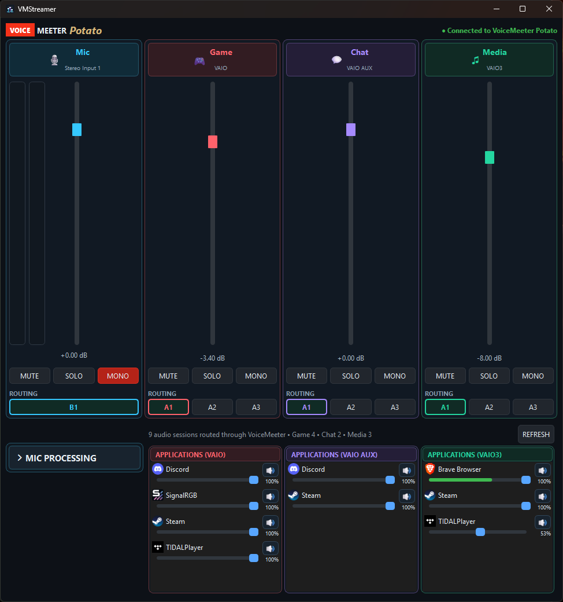

# VMStreamer

A modern, lightweight control panel for **VoiceMeeter Potato**, designed for streamers and content creators.

VMStreamer provides a clean interface for managing your microphone, mixer channels, Windows application audio, and microphone processing without constantly switching back to the VoiceMeeter interface.

## Preview



## Features

### Mixer Control

Control your main VoiceMeeter channels directly from VMStreamer:

- Microphone
- Game
- Chat
- Media
- Volume / gain control
- Mute
- Solo
- Mono
- Live audio level meters

### Application Audio

VMStreamer automatically detects Windows audio sessions and displays applications routed through VoiceMeeter.

Applications are grouped according to their VoiceMeeter output:

- **Game** — VoiceMeeter VAIO
- **Chat** — VoiceMeeter VAIO AUX
- **Media** — VoiceMeeter VAIO3

Each application provides:

- Individual volume control
- Mute control
- Live audio level indication
- Automatic session detection
- Search and refresh functionality

### Microphone Processing

VMStreamer provides direct control over VoiceMeeter's microphone processing.

#### Compressor

- Compression amount
- Input gain
- Ratio
- Threshold
- Attack
- Release
- Knee
- Output gain
- Auto makeup

#### Gate

- Gate amount
- Threshold
- Damping
- Sidechain
- Attack
- Hold
- Release

#### Denoiser

- Denoiser amount

All processing controls are synchronized directly with VoiceMeeter.

### Live Audio Meters

VMStreamer includes real-time audio monitoring for:

- Microphone input
- Game
- Chat
- Media
- Windows applications

Application audio monitoring uses a dedicated sampling loop to keep the interface responsive and prevent audio metering from blocking the graphical interface.

## Requirements

- Windows 10 / Windows 11
- VoiceMeeter Potato
- Python 3.14+ for running from source

### Python Dependencies

- PySide6
- voicemeeter-api
- pycaw
- comtypes
- psutil

## Running From Source

Clone the repository:

```powershell
git clone https://github.com/GuylianDeJong/VMStreamer.git
cd VMStreamer
```

Create a virtual environment:

```powershell
python -m venv .venv
```

Activate it:

```powershell
.\.venv\Scripts\Activate.ps1
```

Install the required dependencies:

```powershell
pip install PySide6 voicemeeter-api pycaw comtypes psutil
```

Run VMStreamer:

```powershell
python main.py
```

## Building the Windows EXE

VMStreamer can be packaged into a standalone Windows executable using PyInstaller.

Install PyInstaller:

```powershell
pip install pyinstaller
```

Build the application:

```powershell
pyinstaller --noconfirm --clean --onefile --windowed --name VMStreamer --icon vmstreamer.ico --add-data "vmstreamer.ico;." main.py
```

The resulting executable will be located at:

```text
dist\VMStreamer.exe
```

## Project Structure

```text
VMStreamer/
├── main.py
├── vmstreamer.ico
├── README.md
└── .gitignore
```

Build files, the Python virtual environment, and other generated files are intentionally excluded from Git.

## VoiceMeeter Configuration

VMStreamer currently works with **VoiceMeeter Potato** and uses the following channels:

| VMStreamer | VoiceMeeter | Windows Device |
| --- | --- | --- |
| Mic | Hardware Input 1 | Focusrite / microphone |
| Game | Strip 6 | VoiceMeeter VAIO |
| Chat | Strip 7 | VoiceMeeter VAIO AUX |
| Media | Strip 8 | VoiceMeeter VAIO3 |

Windows applications routed through these VoiceMeeter devices are automatically detected and displayed in the corresponding VMStreamer section.

## Application Design

VMStreamer is built with:

- Python
- PySide6 / Qt
- voicemeeter-api
- pycaw
- Windows Core Audio

The application uses separate worker threads for Windows application audio monitoring and VoiceMeeter level monitoring so that audio processing does not block the graphical interface.

## Status

VMStreamer is currently under active development.

The core mixer, microphone processing, application routing, live audio meters, and Windows application volume controls are functional.

## Future Improvements

- Additional VoiceMeeter controls
- Improved configuration management
- User-customizable layouts
- Presets
- Streamer-focused workflow improvements
- Installer and distribution improvements

## License

VMStreamer is licensed under the [MIT License](LICENSE).

VMStreamer is an independent third-party project and is not affiliated with or endorsed by VB-Audio Software.

---

**VMStreamer**  
A simple control surface for VoiceMeeter Potato.
